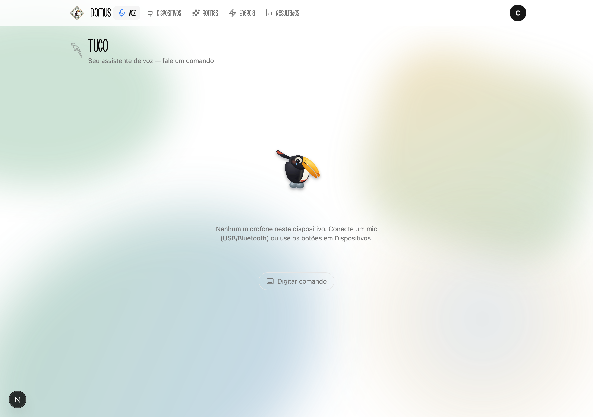
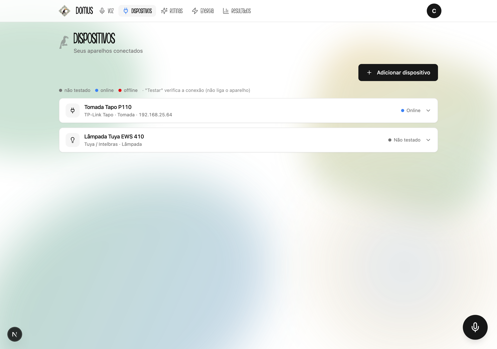
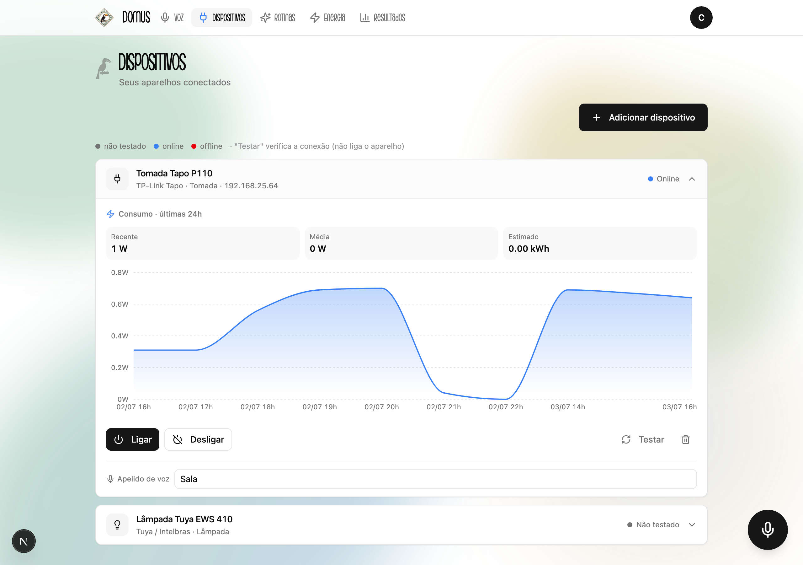
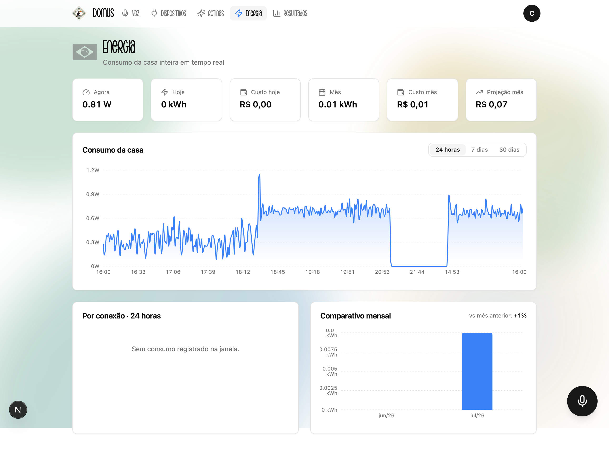
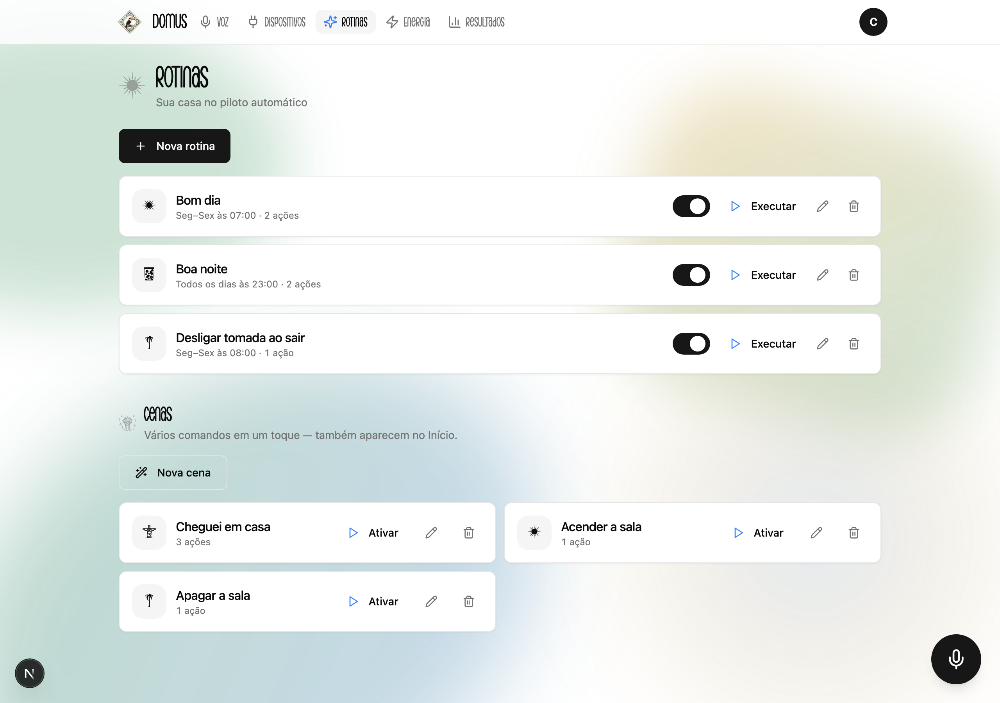
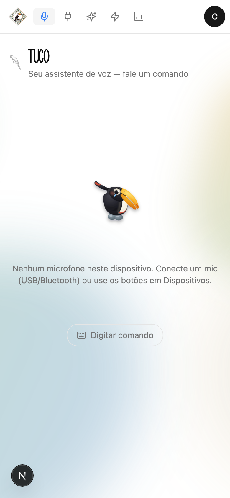
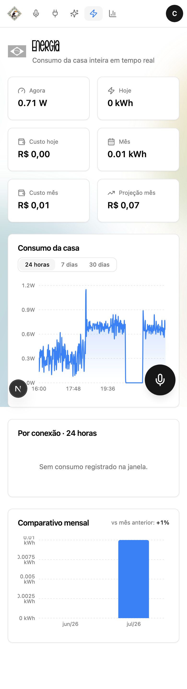
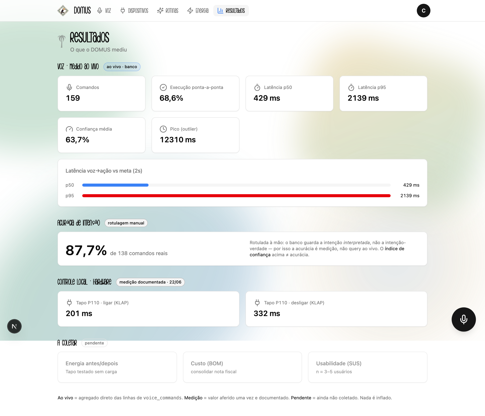
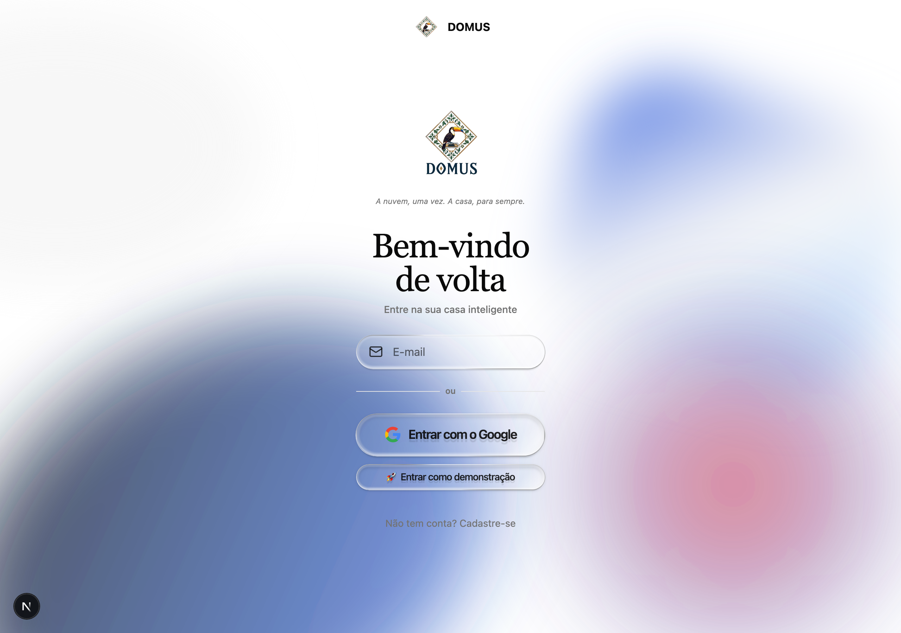
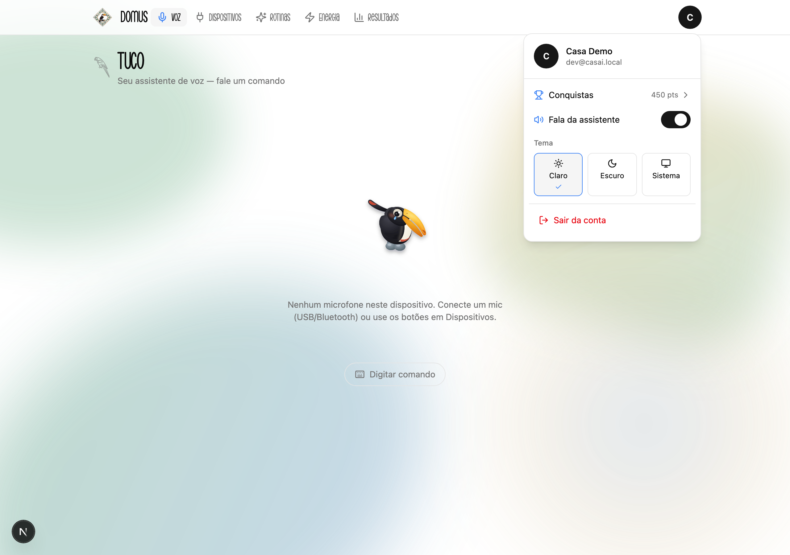

<p align="center">
  
</p>
<p align="center"><em>A nuvem, uma vez. A casa, para sempre.</em></p>

# DOMUS — automação residencial local-first, barata e por voz em português

> Este README é o meu caderno de bordo: conta o TCC na ordem em que eu pensei e
> construí, do problema que me incomodava até os números que consegui medir. É a
> mesma linha da defesa (os slides em [`docs/tcc/SLIDES_DOMUS_ESTRUTURA.md`](docs/tcc/SLIDES_DOMUS_ESTRUTURA.md)),
> só que com as telas reais do sistema no meio.

Eu queria responder uma pergunta simples: **por que a casa inteligente ainda não
chegou na casa da família brasileira típica, se o hardware já é barato?** O DOMUS é
a minha tentativa de resposta em código — um hub que roda **100% na rede local**,
entende **voz em português**, e não depende da nuvem pra funcionar no dia a dia.

> **Minha tese.** A democratização da casa inteligente depende **menos do preço do
> hardware** (lâmpada/tomada Wi-Fi genérica já custa R$ 30–60) e **mais da redução da
> barreira de comissionamento** — instalar e conectar o aparelho **sem o app do
> fabricante e sem portal de desenvolvedor**. O princípio que segui o tempo todo:
> **"a nuvem uma vez, a casa para sempre"** — a nuvem entra só na instalação, pra
> descobrir o device e pegar a chave local; daí em diante o controle é todo na LAN.
>
> Monografia (esboço v0.8): [docs/monografia/MONOGRAFIA_ESBOCO.md](docs/monografia/MONOGRAFIA_ESBOCO.md).

---

## 1. A dor que me incomodava

Comecei olhando o preço e travei numa contradição: **o hardware já é barato, mas a
casa inteligente continua inacessível.** Fui atrás do porquê e encontrei três barreiras
encadeadas — e nenhuma delas é o preço:

1. **Comissionamento.** Pra parear a lâmpada, você precisa do app do fabricante, de uma
   conta na nuvem e, pra controlar localmente, de credenciais escondidas atrás de
   portais de desenvolvedor em inglês.
2. **Dependência de nuvem.** A casa "para" quando a internet cai — o interruptor
   inteligente fica menos confiável que o burro.
3. **Privacidade.** Áudio e hábitos vão pra servidores de terceiros, o que tensiona a LGPD.

Os dados fecham o quadro: só **16,4%** dos domicílios brasileiros têm algum dispositivo
de casa inteligente (vs ~44% em EUA/UK), e apenas **22%** têm conectividade satisfatória
(CETIC.br, 2024). Ou seja: o gargalo não é o preço da lâmpada — é tudo que vem **antes**
de ela funcionar.

## 2. A pergunta que eu decidi responder

> É viável um sistema **por voz em pt-BR, local-first, com hardware barato, que uma
> pessoa não-técnica consiga comissionar** — sem app do fabricante e sem portal de dev?

Minha hipótese (falsificável, do jeito que a banca gosta): **a democratização depende
mais de derrubar a barreira de comissionamento do que de baratear o hardware.**

## 3. O que eu me propus a demonstrar

- **Geral:** provar a viabilidade técnica de um hub local-first, barato, por voz pt-BR,
  com um comissionamento que reduza a barreira de acesso.
- **Específicos:** (1) uma arquitetura que isole a fragmentação de protocolos;
  (2) voz pt-BR **no hub**, sem mandar áudio pra nuvem; (3) validar controle local de
  hardware real (latência/confiabilidade); (4) comissionar sem app/portais; (5) montar
  um protocolo de avaliação (custo, voz, energia, usabilidade).

## 4. As ideias por trás do DOMUS

- **Local-first.** O plano de controle (voz, chaves, dados) existe e funciona **na
  instalação local**. Se o controle local quebra, o sistema **avisa** — não cai
  silenciosamente pra nuvem.
- **Comissionamento × controle.** O Home Assistant resolve o *controle*, mas pressupõe
  que você já pareou pelo app do fabricante. O gargalo está **antes** — é nele que eu
  bati.
- **Voz no hub.** O Whisper transcreve **localmente**; o áudio **não sai** de casa
  (alinhado à minimização da LGPD).
- **Padrão Adapter.** Nenhum controller fala com `tuyapi` ou `tp-link-tapo-connect`
  direto — tudo passa por uma interface `DeviceAdapter`, e existe um `MockAdapter` que
  faz o sistema inteiro rodar **sem hardware nenhum**.

## 5. Como eu construí (arquitetura)

- **Hub (backend):** **NestJS + Prisma + PostgreSQL** — controle local de
  Tuya/Intelbras e Tapo, voz (Whisper no hub), energia, rotinas, cenas.
- **App (web PWA):** **Next.js 15** instalável no celular ("Adicionar à tela inicial"),
  topbar minimalista, tempo real via Socket.IO, tema claro/escuro.
- **Segurança:** JWT; a `local_key` do Tuya é cifrada em **AES-256-GCM** antes de salvar
  (nunca logada, nunca commitada); toda query é escopada por usuário.

> **Duas decisões que registrei no caminho (ADRs, em [CLAUDE.md](CLAUDE.md)):**
> **(ADR-001)** não usar Home Assistant como núcleo — o hub é *a* contribuição do TCC, e
> não existe "API Intelbras" separada (a linha Izy é Tuya white-label, coberta pelo
> `tuyapi`). **(ADR-002)** o app é **web PWA**, não Expo — instala como app no celular
> sem loja e simplifica a demo.

A navegação do app segue a própria história da defesa: **Voz → Dispositivos → Rotinas →
Energia → Resultados**.

## 6. TUCO — a voz em português

A cara do projeto é o **TUCO** (um tucano), o assistente por voz. O fluxo: você fala →
**o Whisper no hub transcreve** → o parser interpreta a intenção → executa, com uma fila
serializada por dispositivo. Funciona **offline**, pela PWA.

<p align="center">
  
</p>

O reconhecimento é tolerante a erro de fala (estilo Alexa/Google): caso o STT ouça
"taipo", o parser ainda casa com "tapo" por similaridade de tokens
(Damerau-Levenshtein). Cada aparelho tem um **apelido de voz** (ex.: `abajur`, `cofre`)
que a assistente reconhece além do nome oficial.

## 7. O que dá pra ver funcionando

**Dispositivos** ficou objetivo: cada conexão é uma linha enxuta e, **ao clicar**, abre
o consumo do aparelho (potência recente/média, kWh estimado, gráfico) e os controles.

<p align="center">
  <br>
  
</p>

**Energia** mostra o escopo geral da casa — todas as conexões somadas — com seletor de
período (**24h em resolução de minutos**, 7 dias, 30 dias), gráfico de área, participação
por conexão (donut) e **comparativo mensal** em barras.

<p align="center">
  
</p>

**Rotinas** junta automações por horário e cenas de um toque:

<p align="center">
  
</p>

E no celular ele é o que promete ser — um app instalado, responsivo:

<p align="center">
  
  &nbsp;&nbsp;
  
</p>

## 8. Os números — o que eu consegui medir

Uma coisa em que insisti: **separar o que é medido ao vivo do que ainda falta coletar**,
sem inflar nada. Por isso a aba **Resultados** existe dentro do próprio sistema — ela lê
as métricas de voz **ao vivo do banco** (`voice_commands`) e mostra, lado a lado, o que
é medição documentada e o que está pendente.

<p align="center">
  
</p>

| Métrica | Valor | Como obtive |
|---|---|---|
| Controle local **Tapo P110** (KLAP) | **201–332 ms** | medição documentada (22/06) |
| Acurácia de **intenção** de voz | **87,7%** (138 comandos) | rotulagem manual do corpus |
| Execução **ponta-a-ponta** | **66,7%** | ao vivo — dominada por hardware offline, não pelo parser |
| Latência **voz→ação** | **p50 463 ms · p95 2140 ms** | ao vivo (outlier de 12,3 s = timeout de hardware) |
| Energia antes/depois · custo (BOM) · SUS | **a coletar** | honestamente pendente |

> Detalhe importante de honestidade: a **acurácia** não sai de uma query — o banco guarda
> a intenção *interpretada*, não a intenção-verdade. Então ela é rotulagem manual, e o
> índice de confiança que o sistema mostra **não é** acurácia. Deixei isso explícito na tela.

## 9. A lâmpada que não pareou — e por que isso importa

A **Intelbras EWS 410 (Tuya)** eu **não** consegui comissionar localmente: ela exige
`local_key`/Device ID via portal, e esbarrei no limite de slots da plataforma. Em vez de
esconder, transformei isso em evidência: **o bloqueio é a prova empírica da barreira de
comissionamento** — ela é real a ponto de travar até o autor do trabalho. A **Tapo P110**,
que não depende de portal de dev, funcionou em forma plena.

## 10. O que ficou de fora (e o que vem depois)

- **Limitações que assumo:** energia medida sem carga real (a Tapo estava a vazio); os
  adapters físicos ficam fora da cobertura de testes **por design** (não dá pra testar
  hardware no CI); a Tuya não foi validada em hardware; e o título é **direcional** —
  contribuição *rumo a* um objetivo, não um resultado fechado.
- **Futuro:** Zigbee/Matter; comissionamento Tuya simplificado; empacotar como
  *appliance* atualizável; multiusuário; avaliação de usabilidade com público idoso.

## 11. Conclusão

O que eu **demonstrei** (forma fraca): é viável o controle local por voz pt-BR **sem
dependência permanente de nuvem**. O que eu **aponto** (forma forte, em aberto): a
democratização passa pelo comissionamento — a hipótese continua de pé, esperando mais
dados. E o princípio segue valendo: **a nuvem, uma vez. A casa, para sempre.**

---

## Como rodar

> Tudo roda **sem hardware** graças ao modo MOCK. Credencial de demonstração já semeada:
> **`dev@casai.local` / `Senha@123`** — ou clique em **"Entrar como demonstração"** no login.

<p align="center">
  
</p>

**Pré-requisitos:** Node.js 20+ · PostgreSQL (Docker ou local). Para a voz por microfone
(Whisper local): `cmake` + `ffmpeg` no PATH (no macOS: `brew install cmake ffmpeg`). Sem
eles, o comando por **texto/botões** funciona; o áudio responde 503.

```bash
# 1. Banco
docker compose up -d casai-db          # PostgreSQL (cria casai_dev e casai_test)

# 2. Backend (apps/api) — API em http://localhost:4000
cd apps/api
cp ../../.env.example .env             # preencha JWT_SECRET e CASAI_ENCRYPTION_KEY
#   gere a chave: node -e "console.log(require('crypto').randomBytes(32).toString('hex'))"
npm install
npx prisma migrate deploy
npx prisma db seed                     # usuário demo + dispositivos MOCK + rotinas + cenas
npm run start:dev

# 3. Web (apps/web) — dashboard em http://localhost:3000
cd ../web
npm install
npm run dev
```

`apps/web/.env.local` usa **proxy same-origin** (o web repassa `/api` e `/socket.io` ao
hub), então o navegador — inclusive o celular — fala só com o web, sem CORS:

```
NEXT_PUBLIC_API_URL=/api               # relativo → mesma origem → proxy p/ o hub
NEXT_PUBLIC_WS_URL=                    # vazio → mesma origem (Socket.IO)
NEXT_PUBLIC_GOOGLE_CLIENT_ID=          # opcional (login com Google)
```

### Variáveis de ambiente principais

| Variável | Para quê |
|----------|----------|
| `DATABASE_URL` / `TEST_DATABASE_URL` | conexão Postgres (dev/test) |
| `JWT_SECRET` | assinatura dos tokens (≥ 32 chars) |
| `CASAI_ENCRYPTION_KEY` | AES-256-GCM dos segredos de device (64 hex) |
| `WHISPER_MODEL` / `WHISPER_LANGUAGE` | STT no hub (padrão `base` / `pt`); `base` ≈ 700 ms/comando |
| `ENERGY_POLL_INTERVAL_SECONDS` | intervalo do polling de energia |
| `GOOGLE_CLIENT_ID` | login com Google (opcional — sem ele, `/auth/google` responde 503) |
| `DEMO_MODE` | `true` semeia dados de demonstração no boot (deploy público) |

### Acesso no celular (microfone) — HTTPS

O `getUserMedia` só funciona em contexto seguro (`https://` ou `http://localhost`). Pelo
IP da LAN em HTTP o mic é bloqueado. Duas formas de servir por HTTPS:

```bash
cd apps/web && npm run dev:https                 # HTTPS na LAN (cert self-signed) → https://<IP>:3443
cloudflared tunnel --url http://localhost:3000   # túnel HTTPS confiável (sem aviso, mic garantido)
```

Depois, no celular, **"Adicionar à tela inicial"** instala o DOMUS como app. Se o
aparelho não tem mic (ex.: Mac mini), use um mic USB/Bluetooth em `http://localhost:3000`
ou controle pelos botões por dispositivo.

### Voz (Whisper no hub)

O STT roda **no hub** com `nodejs-whisper` (whisper.cpp em CPU) — ele compila com CMake e
baixa o modelo na primeira transcrição. O áudio é **descartado logo após transcrever**, a
transcrição é apagada logo após executar o comando, e o log de auditoria (sem o conteúdo)
vive no máximo **24 h** (expurgo diário automático) — minimização e finalidade da LGPD.

### Testes

```bash
cd apps/api && npm test              # unitários (sem banco)
npm run test:e2e                     # e2e supertest (usa casai_test)
npm run test:cov                     # cobertura (meta ≥ 80% statements/lines)
cd ../web && npm run lint && npm run build
```

Adapters Tuya/Tapo, o scanner de rede e o STT nativo ficam **fora** da cobertura (não
testáveis sem hardware/rede — regra do [CLAUDE.md](CLAUDE.md)).

### Deploy da defesa

Guia completo em [docs/setup/DEPLOY.md](docs/setup/DEPLOY.md). Em resumo: **defesa ao
vivo** com `docker compose up -d` no notebook + hotspot próprio + lâmpada/tomada na mesa;
**URL pública** pra banca via Vercel (web) + Render (API+Postgres free, `render.yaml`) com
`DEMO_MODE=true` — custo **R$ 0**.

---

## Hardware-alvo (~R$ 130)

| Dispositivo | Modelo | Protocolo | Capacidades |
|-------------|--------|-----------|-------------|
| Lâmpada LED | Intelbras EWS 410 | Wi-Fi / Tuya | on/off, brilho, cor RGB |
| Tomada | TP-Link Tapo P110 | Wi-Fi / Tapo | on/off, energia (W, kWh) |

Antes de usar hardware real, valide com os **spikes**: [spikes/README.md](spikes/README.md)
e [docs/hardware/HARDWARE_SETUP.md](docs/hardware/HARDWARE_SETUP.md).

## Menu da conta

O que não é o foco da banca fica discreto no menu da conta (avatar → **Conquistas**, fala
da assistente, tema, sair):

<p align="center">
  
</p>

## Onde ler mais

- **Slides da defesa:** [docs/tcc/SLIDES_DOMUS_ESTRUTURA.md](docs/tcc/SLIDES_DOMUS_ESTRUTURA.md)
- **Monografia (esboço):** [docs/monografia/MONOGRAFIA_ESBOCO.md](docs/monografia/MONOGRAFIA_ESBOCO.md)
- **Decisões e convenções:** [CLAUDE.md](CLAUDE.md)
- **Setup de hardware:** [docs/hardware/HARDWARE_SETUP.md](docs/hardware/HARDWARE_SETUP.md)
